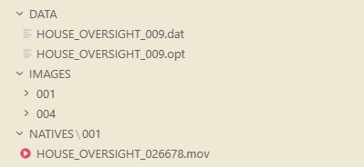

# House Oversight Committee: Document Processing Pipeline

## LIVE: Auto-Processing and Publishing

**This repository is processing committee documents and publishing findings in real-time.**

As House Oversight Committee documents are analyzed, images are processed, text is extracted, and connections are revealed. The system automatically commits and publishes updates every 5 minutes with detailed summaries of the latest findings.

P25-12-19 15:02:44  
**Update Frequency:** Every 5 minutes  
**Status:** Processing continue with Gemini 3.0 Flash

### Latest Context Update

### Processing Status

- Total documents analyzed: 1455
- Named individuals identified: 55
- Organizations found: 108
- Document types: image_analysis

(Strategic analysis temporarily unavailable - processing continues)

---

## How Does This Work?

When the data is released by the committee, we expect to see a file structure similar to this:

<p align="center">
  
</p>

The committee typically releases different file types organized in all-capital folders. Once these files are added to this codebase, the process becomes fully automatic:

- **Parsing & Extraction:** Every image and document is parsed for names, dates, context, and full text. Even for long-form articles or extensive text, everything is extracted using **Gemini 3**.
- **Organization:** Extracted text is organized into specialized file formats designed to reveal connections among people, timestamps, and other critical details.
- **API Safety Filters:** Much of the content of these files will be flagged by the Google api filters, in those cases, it might be the refusal by google to touch it that is most helpful to reporters because they can manually go to that exact file and see why google wouldn't process it. This might cut the workload by 10X.
- **Rapid Deployment:** This pipeline is designed to be fully operational within one hour of the files being released by the committee.

---

## How to Start the Pipeline

> [!IMPORTANT]
> **You don't actually need to run anything.** I am processing the files with this code and publishing the results in real-time—this documentation is provided here for transparency. Unless you are a reporter working on a story, the updates published every 5 minutes at the top of this page will likely be the easiest and most effective way to access the information.

Follow these steps to start the full automated processing and publishing pipeline:

### 1. Environment Setup
Ensure you have your `GEMINI_API_KEY` configured in a `.env` file within the `PIPELINE` directory.

### 2. Launch Document Processing
This command starts the core analysis engine. It will process all images, text, and data files in the target batch.
```powershell
python PIPELINE/run_pipeline.py --process all --source DecemberBatch
```

### 3. Enable Auto-Publishing
In a separate terminal, launch the auto-commit webhook. This script monitors for new findings every 5 minutes, updates this README with a summary, and pushes all updates to the remote repository.
```powershell
python PIPELINE/auto_commit_webhook.py --interval 5
```

---

## Technical Overview

This repository contains a generalized automated system that processes thousands of House Oversight Committee documents using AI-powered analysis.

### Automated Document Processing Pipeline

The system runs multimodal processing streams simultaneously:

#### 1. Image Analysis & Entity Extraction
**All images are analyzed by Gemini 3.0 Flash** with:
- **OCR Text Extraction** - Full text extraction from every image
- **Entity Discovery** - Identifying people, organizations, and relationships
- **Visual Intelligence** - Document type classification and layout analysis
- **Structured Data** - Dates, names, locations, and signatures

#### 2. Text Document Processing
**Volumes of text documentation** are processed:
- Content extraction and context understanding
- Grouping related events into coherent narratives
- Narrative assembly and connection mapping

#### 3. Visual Summarization (Nano Banana)
**Gemini 3 Pro Image (Nano Banana)** generates high-fidelity editorial illustrations summarizing the most significant recent discoveries.

---

## Repository Structure

```
GovernmentPipeline/
├── PIPELINE/                   ← Core processing engine and tools
├── DecemberBatch/              ← Active source documents being processed
└── README.md                   ← Real-time status and overview
```

---

## Technical Details

### Processing Technology

- **AI Model:** Google Gemini 3.0 Flash (for text, image analysis, and reasoning)
- **Visual Summaries:** Nano Banana / Gemini 3 Pro Image (for editorial summaries)
- **Processing Method:** LLM-powered extraction and analysis
- **Output:** Structured JSON with full provenance tracking
- **Publishing:** Automated git commits via scheduled updates

### Data Integrity

- All original documents are **preserved unchanged**
- Analysis files are **additive only** (JSON metadata alongside originals)
- Full **provenance tracking** in all outputs
- **Transparent and verifiable** processing history

---

## Contact

For questions about this repository or the processing pipeline, see the technical documentation in the `PIPELINE` folder.
